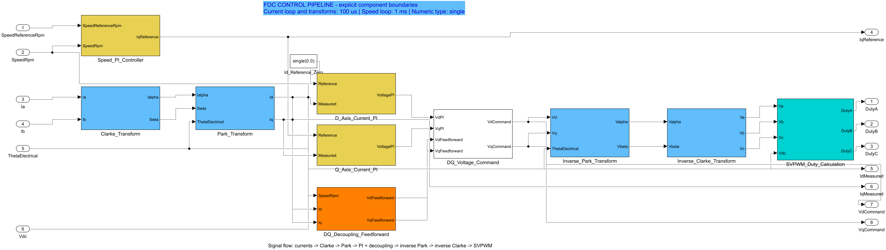
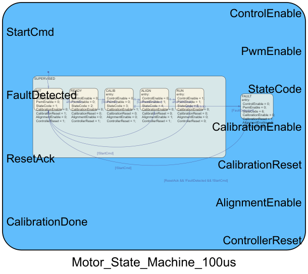
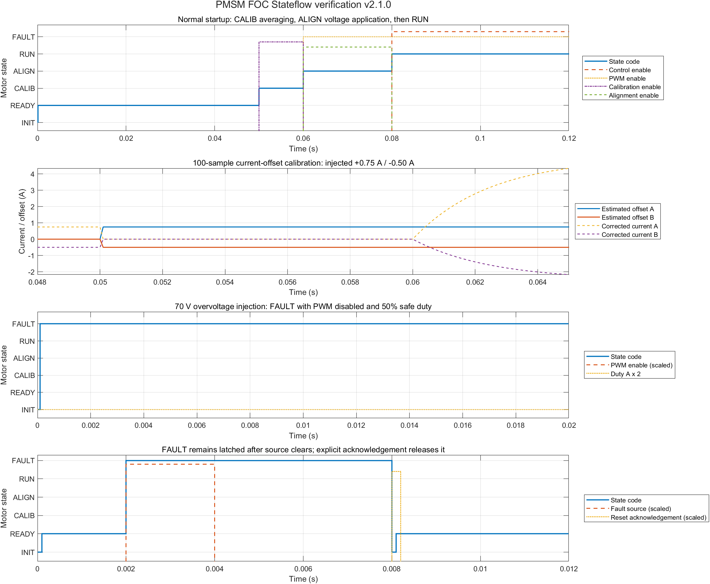

# PMSM FOC Dual Plant v2.1.0

该版本在 `PMSM_FOC_Native_v2.0.0` 的离散 FOC 闭环模型上加入可切换的 MathWorks Motor Control Blockset PMSM HDL 被控对象，并新增 Stateflow 电机运行状态管理、安全监测和 PWM 门控。原 v2.0.0 目录和模型保持不变；两个电机对象共用同一组件化 FOC 控制器、平均逆变器、状态机、工况和信号接口，可直接比较控制效果。

## 文件与模型

- `PMSM_FOC_DualPlant_ClosedLoop_v21.slx`：闭环仿真顶层模型。
- `PMSM_FOC_DualPlant_Controller_v21.slx`：可独立生成 ERT C 代码的控制器模型。
- `build_pmsm_foc_dualplant_v21.m`：配置模型、依次仿真两个电机对象、绘图、导出架构图、生成代码并写入验收报告。
- `refactor_pmsm_foc_controller_v21.m`：清空旧顶层连线，并按经典级联 FOC 拓扑重建两个 v2.1.0 模型。
- `add_pmsm_foc_stateflow_v21.m`：幂等集成 Stateflow 状态机、电流偏置校准、转子对齐、安全监测和 PWM 门控。
- `switch_pmsm_plant_v21.m`：停止仿真时切换 Variant 选择。
- `verification_report.txt`：最近一次自动验收数据。
- `PMSM_FOC_DualPlant_v21_results.png`：关键曲线对比。
- `PMSM_FOC_DualPlant_v21_stateflow_results.png`：正常启动与故障注入状态曲线。
- `doc/PMSM_FOC_DualPlant_v2.1.0_Architecture_and_Test_Manual.tex`：架构与测试手册 LaTeX 源文件。
- `doc/PMSM_FOC_DualPlant_v2.1.0_Architecture_and_Test_Manual.pdf`：编译后的完整手册。

## 模型架构

闭环信号链如下：

```text
速度给定 -> Speed PI (1 ms) -> Rate Transition -> Iq PI ─┐
Id*=0 --------------------------------------------> Id PI ├-> DQ 电压合成
                                                        │
PMSM Ia/Ib -> Clarke -> Park -> Id/Iq ------------------┘
                              │
PMSM 转速 --------------------┴-> DQ 解耦前馈 ----------┘

DQ 电压 -> 逆 Park -> 逆 Clarke -> SVPWM -> 平均逆变器 -> PMSM
             ^                                          │
             └---------------- 电角度 -------------------┘
```

顶层 Simulink 架构：


可选 PMSM Variant 子系统：


### FOC 控制组件及责任边界

控制器采用与经典级联 FOC 框图一致的顶层数据流：`Speed_PI_Controller_1ms` 形成速度外环，显式 `IqRef_Rate_Transition` 将 1 ms 的电流给定传递到 100 us 任务；Clarke、Park、D/Q 轴 PI、解耦前馈、DQ 电压合成、逆 Park、逆 Clarke 和 SVPWM 均直接显示为顶层独立组件。模型不再用一个 `Current_Control_100us` 大子系统遮蔽电流环结构，图中的前向控制链与电流/角度反馈链均可直接追踪。



| 组件 | 单一责任 | 主要接口 | 关键参数或约束 |
| --- | --- | --- | --- |
| `Speed_PI_Controller_1ms` | 将速度误差转换为 q 轴电流给定，构成速度外环 | `SpeedReferenceRpm`, `SpeedRpm` → `IqReference` | 独立 1 ms 任务；`FOC_Native_KpSpeed`、`FOC_Native_KiSpeed`；±`FOC_Native_IqLimit` |
| `Current_Offset_Calibration_100us` | 对静止电流采样求均值并保持 A/B 相偏置，输出校正电流 | Raw Ia/Ib、校准使能/复位 → Corrected Ia/Ib、Offset、Done | 100 us；100 样本；INIT/FAULT 清零 |
| `Clarke_Transform` | 两相采样电流转换到静止 α/β 坐标系 | `Ia`, `Ib` → `Ialpha`, `Ibeta` | `Ialpha=Ia`；`Ibeta=(Ia+2Ib)/sqrt(3)` |
| `Park_Transform` | α/β 电流转换到旋转 d/q 坐标系 | `Ialpha`, `Ibeta`, `ThetaElectrical` → `Id`, `Iq` | 正弦/余弦角度变换；100 us 数据通路 |
| `D_Axis_Current_PI` | 将 d 轴电流调节到 0 A | `Reference=0`, `Id` → `VdPI` | 100 us；电流 PI 参数；积分器限幅 ±30 |
| `Q_Axis_Current_PI` | 跟踪速度环给出的 q 轴电流 | `IqReference`, `Iq` → `VqPI` | 100 us；电流 PI 参数；积分器限幅 ±30 |
| `DQ_Decoupling_Feedforward` | 补偿 d/q 轴交叉耦合与反电动势 | `SpeedRpm`, `Id`, `Iq` → `VdFeedforward`, `VqFeedforward` | 极对数、`Ld`、`Lq`、永磁磁链 |
| `DQ_Voltage_Command` | 合并 PI 与前馈项并形成有界电压指令 | PI/前馈电压 → `VdCommand`, `VqCommand` | d/q 轴分别限幅至 ±26 V |
| `Alignment_DQ_Override_100us` | 仅在 ALIGN 状态选择固定对齐电压和电角度 | FOC Vd/Vq、反馈角、`AlignmentEnable` → Applied Vd/Vq/Theta | `Vd=2 V`、`Vq=0 V`、`Theta=0 rad` |
| `Inverse_Park_Transform` | d/q 电压转换回静止 α/β 坐标系 | `Vd`, `Vq`, `ThetaElectrical` → `Valpha`, `Vbeta` | 与 Park 变换采用同一电角度约定 |
| `Inverse_Clarke_Transform` | α/β 电压转换为三相电压 | `Valpha`, `Vbeta` → `Va`, `Vb`, `Vc` | `Va=Valpha`；B/C 相使用 ±`sqrt(3)/2` |
| `SVPWM_Duty_Calculation` | 公共模注入、母线归一化和占空比限幅 | `Va`, `Vb`, `Vc`, `Vdc` → `DutyA/B/C` | `Voffset=-0.5(max+min)`；占空比 0.02～0.98 |

速度环与电流环不再混放在同一个顶层控制器块内：速度 PI 的状态更新周期为 1 ms；电流校准、Clarke/Park、D/Q 电流 PI、对齐覆盖、逆变换和 SVPWM 属于 100 us 任务；中间的 Rate Transition 明确承担跨速率数据传递。控制器代码生成模型采用 7 输入/8 输出接口，第 7 个输入 `FaultResetAck` 是故障复位的显式用户确认。重构脚本每次先删除旧顶层信号线，再按已知级联拓扑完整重连，并检查源端或目标端缺失的悬空线，因此不会保留图中曾出现的红色虚线分支。

### Stateflow 电机运行状态管理

`Motor_State_Machine_100us` 是控制使能与 PWM 使能的唯一所有者，采样周期为 100 us。`SUPERVISED` 父状态统一包含 INIT、READY、CALIB、ALIGN、RUN，父状态只用一条故障迁移进入顶层 FAULT，避免每个状态各自连接故障线造成交叉和红线堆叠。



| 状态码 | 状态 | 责任 | 主要转换条件 | Control/PWM |
| ---: | --- | --- | --- | --- |
| 1 | INIT | 确定的上电/复位初态 | 1 tick 后进入 READY | 0 / 0 |
| 2 | READY | 等待启动命令 | `StartCmd` 后进入 CALIB | 0 / 0 |
| 3 | CALIB | 启动 100 样本电流偏置均值计算 | `CalibrationDone` 后进入 ALIGN；150 tick 超时进 FAULT | 0 / 0 |
| 4 | ALIGN | 施加 2 V d 轴电压、零 q 轴和固定角度 | 200 tick 后进入 RUN；撤销启动回 INIT | 0 / 1 |
| 5 | RUN | 放行速度指令和闭环 SVPWM | 撤销启动回 INIT；故障进 FAULT | 1 / 1 |
| 6 | FAULT | 关闭 PWM、清零校准和 PI 状态并保持锁存 | 仅 `FaultResetAck && !FaultDetected && !StartCmd` 回 INIT | 0 / 0 |

`Motor_Safety_Monitor_100us` 将过速（绝对转速大于 3000 rpm）、A/B 相过流（绝对值大于 12 A）以及母线欠压/过压（低于 10 V 或高于 60 V）合成为 `FaultDetected`。ALIGN 使用固定对齐电压并拥有 PWM；RUN 放行闭环速度给定和 SVPWM；其他状态强制三相安全占空比 0.5。速度和两个电流 PI 在非 RUN 状态由 `ControllerReset` 清零。闭环模型把全部测试信号收拢在 Harness 专用 `Motor_Stateflow_Test_Logging` 子系统中，该子系统不进入 ERT 控制器目标。

两个电机对象的公共接口为：

| 方向 | 信号 | 含义 |
| --- | --- | --- |
| 输入 | `VAlpha`, `VBeta` | 静止 α/β 坐标系定子电压指令 |
| 输入 | `LoadTorque` | 负载转矩，N·m |
| 输出 | `SpeedRpm` | 机械转速，rpm |
| 输出 | `ThetaElectrical` | 电角度，rad |
| 输出 | `Ia`, `Ib` | A/B 相电流，A |
| 输出 | `TorqueNm` | 电磁转矩，N·m |
| 输出 | `Id`, `Iq` | d/q 轴电流，A |

MathWorks 分支将 α/β 电压转换为三相电压后送入官方 `mcbhdlplantlib/PMSM HDL` 块，再将官方块输出转换回上述公共接口。

## 仿真工况与关键参数

仿真使用 MATLAB/Simulink R2024a，求解器为 `FixedStepDiscrete`，仿真时长 2.0 s。

| 类别 | 参数 | 数值 |
| --- | --- | ---: |
| 工况 | 速度给定 | 0.05 s 时由 0 阶跃至 1000 rpm |
| 工况 | 负载转矩 | 0.5 s 时由 0 阶跃至 0.2 N·m |
| 电源 | 直流母线电压 | 48 V |
| 调度 | 电流环/基础步长 | 100 us |
| 调度 | 速度环周期 | 1 ms |
| 速度环 | `Kp`, `Ki` | 0.02, 0.05 |
| 电流环 | `Kp`, `Ki` | 1.0, 500.0 |
| 限幅 | q 轴电流 | ±8 A |
| 限幅 | 电流积分器 | ±30 |
| 限幅 | 电压指令 | ±26 V |
| 限幅 | 三相占空比 | 0.02～0.98 |
| 电机 | 定子电阻 `Rs` | 0.4 Ω |
| 电机 | d/q 轴电感 `Ld`, `Lq` | 1 mH, 1 mH |
| 电机 | 永磁磁链 `λpm` | 0.05 Wb |
| 电机 | 极对数 | 4 |
| 电机 | 转动惯量 `J` | 0.002 kg·m² |
| 电机 | 黏性阻尼 `B` | 0.0001 N·m·s/rad |

## 关键曲线

下图由同一次脚本运行依次仿真两个 Variant 后生成，包含机械转速、q 轴电流、电磁转矩和 A 相占空比。实线为原生离散 PMSM，虚线为 MathWorks PMSM HDL；两条曲线在当前参数和工况下基本重合。


## 仿真数据与验收结果

最近一次 MATLAB R2024a 自动验证结果：

| 指标 | Native 离散 PMSM | MathWorks PMSM HDL |
| --- | ---: | ---: |
| 最终转速 | 996.191467 rpm | 996.191345 rpm |
| 最大转速 | 1084.86560 rpm | 1084.86560 rpm |
| 最大绝对 `Iq` | 2.14349961 A | 2.14349937 A |
| Duty A 最小值 | 0.0849514306 | 0.0849514306 |
| Duty A 最大值 | 0.915057063 | 0.915057063 |
| 最终电磁转矩 | 0.201538101 N·m | 0.201538414 N·m |
| 闭环限值检查 | PASS | PASS |

两个分支的最终转速在记录精度内一致，最大转速差约 0.00012 rpm；关键曲线和稳态数据表明两个被控对象在当前平均值闭环工况下具有一致的控制响应。

Stateflow 正常启动测试依次访问 `[1 2 3 4 5]`，0.06 s 完成 100 样本电流校准，0.08 s 进入 RUN；注入的 A/B 相偏置 `+0.75/-0.50 A` 被准确估计，校准完成时校正电流均为 0 A。ALIGN 期间实际施加 `Vd=2 V`、`Vq=0 V` 且 PWM 有效。70 V 母线过压在 0.0001 s 进入 FAULT，PWM 关闭、Duty A 为 0.5。

故障矩阵分别从 INIT、READY、CALIB、ALIGN 和 RUN 注入短故障脉冲；在故障源清除且没有确认时，五个场景均保持 FAULT。独立确认测试在 0.004 s 清除故障源，状态持续锁存至 0.008 s 的 `FaultResetAck` 脉冲才退出，最终进入 READY。上述测试均 PASS。



结构与代码检查同时确认：Variant 分支数为 2，官方块引用为 `mcbhdlplantlib/PMSM HDL`；12 个独立控制组件、6 个运行状态、显式故障确认端口和双速率调度均存在；控制器为 7 输入/8 输出，两个模型悬空线数均为 0；ERT 生成代码包含输入/输出结构、`initialize/step` 接口、校准/对齐算法和 Stateflow 逻辑，未检测到 S-Function 文本。

## 切换电机对象

模型工作区变量 `PMSM_PLANT_SELECTION` 控制 Variant：

- `1`：`Native_Discrete_PMSM`
- `2`：`MathWorks_MCB_PMSM_HDL`（默认）

仿真停止时，可单击模型中的 Dashboard `Switch_PMSM_Plant` 按钮切换电机分支；按钮会调用 `switch_pmsm_plant_v21.m` 并显示新的活动对象。下一次开始仿真时编译所选分支。旧版富文本超链接已删除，因为 Simulink 导出 PNG 时会把其 HTML 原文铺在架构图上。

## 重建与复核

在 MATLAB 中将当前目录切换到本目录并运行：

```matlab
build_pmsm_foc_dualplant_v21
```

脚本会依次验证两个被控对象、正常启动、数值校准、对齐输出、过压关断、五状态故障锁存矩阵和确认复位，刷新六幅 PNG 文档图，核对 12 个控制组件、7 输入/8 输出接口、6 个 Stateflow 状态、双速率任务和接口连线，重建控制器 ERT C 代码并更新 `verification_report.txt`。生成 C 代码的目标仅为控制器模型；两个 PMSM 被控对象和 Harness 测试日志不进入控制器目标代码。

所需产品包括 Simulink、Motor Control Blockset、Simulink Coder 和 Embedded Coder。
