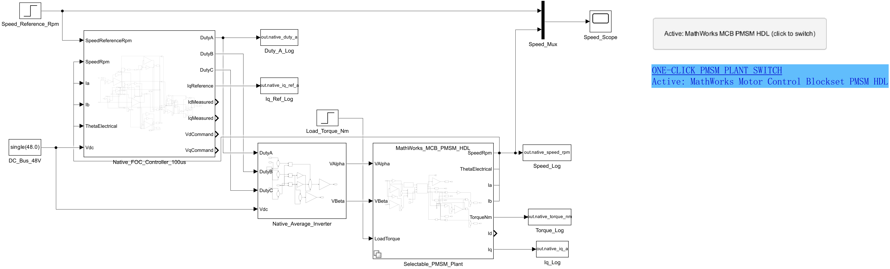
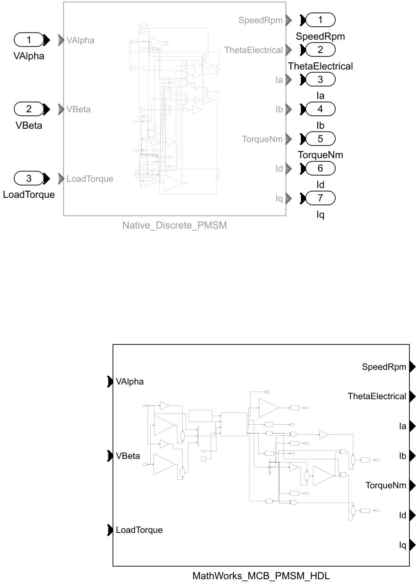
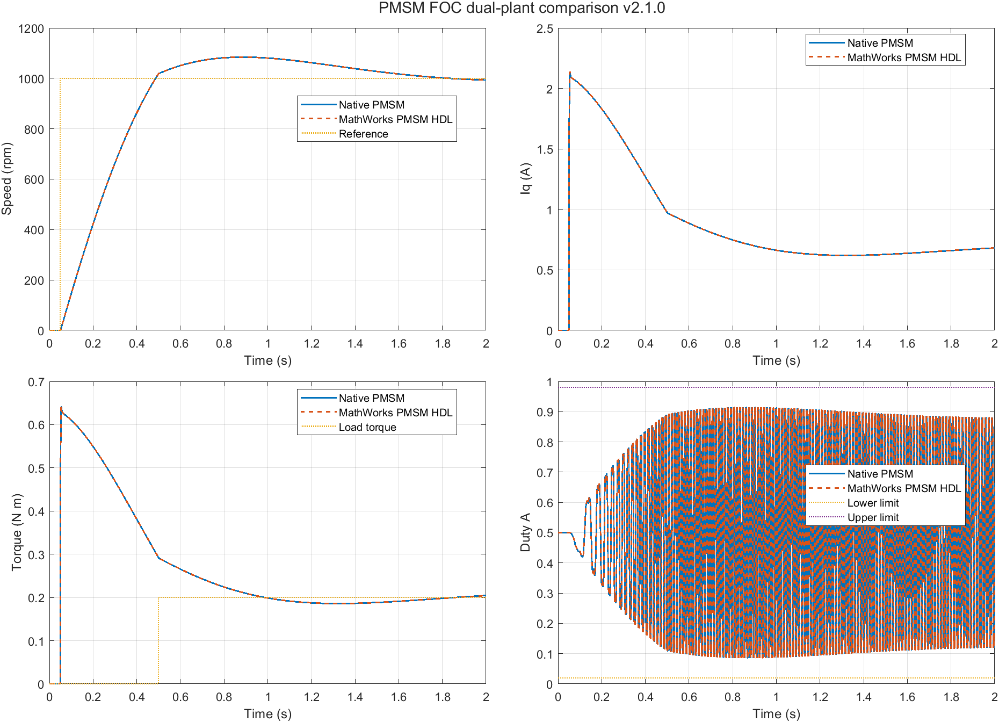

# PMSM FOC Dual Plant v2.1.0

该版本在 `PMSM_FOC_Native_v2.0.0` 的离散 FOC 闭环模型上加入可切换的 MathWorks Motor Control Blockset PMSM HDL 被控对象。原 v2.0.0 目录和模型保持不变；两个电机对象共用同一 FOC 控制器、平均逆变器、工况和信号接口，可直接比较控制效果。

## 文件与模型

- `PMSM_FOC_DualPlant_ClosedLoop_v21.slx`：闭环仿真顶层模型。
- `PMSM_FOC_DualPlant_Controller_v21.slx`：可独立生成 ERT C 代码的控制器模型。
- `build_pmsm_foc_dualplant_v21.m`：配置模型、依次仿真两个电机对象、绘图、导出架构图、生成代码并写入验收报告。
- `switch_pmsm_plant_v21.m`：停止仿真时切换 Variant 选择。
- `verification_report.txt`：最近一次自动验收数据。
- `PMSM_FOC_DualPlant_v21_results.png`：关键曲线对比。

## 模型架构

闭环信号链如下：

```text
1000 rpm 速度阶跃 ─┐
电机速度/电流/角度 ─┼─> FOC Controller ─> Duty A/B/C ─> 48 V 平均逆变器
48 V 直流母线 ──────┘                                      │
                                                            v
                              Selectable_PMSM_Plant (Variant Subsystem)
                              ├─ Native_Discrete_PMSM
0.2 N·m 负载阶跃 ────────────>└─ MathWorks_MCB_PMSM_HDL
                                                            │
                         SpeedRpm, ThetaElectrical, Ia/Ib, TorqueNm, Id/Iq
```

顶层 Simulink 架构：



可选 PMSM Variant 子系统：



FOC 控制器包含 Clarke/Park 变换、1 ms 速度 PI 环、100 us d/q 电流 PI 环、交叉耦合前馈、逆 Park 变换、公共模注入 SVPWM 和三相占空比限幅。两个电机对象的公共接口为：

| 方向 | 信号 | 含义 |
| --- | --- | --- |
| 输入 | `VAlpha`, `VBeta` | 静止 α/β 坐标系定子电压指令 |
| 输入 | `LoadTorque` | 负载转矩，N·m |
| 输出 | `SpeedRpm` | 机械转速，rpm |
| 输出 | `ThetaElectrical` | 电角度，rad |
| 输出 | `Ia`, `Ib` | A/B 相电流，A |
| 输出 | `TorqueNm` | 电磁转矩，N·m |
| 输出 | `Id`, `Iq` | d/q 轴电流，A |

MathWorks 分支将 α/β 电压转换为三相电压后送入官方 `mcbhdlplantlib/PMSM HDL` 块，再将官方块输出转换回上述公共接口。

## 仿真工况与关键参数

仿真使用 MATLAB/Simulink R2024a，求解器为 `FixedStepDiscrete`，仿真时长 2.0 s。

| 类别 | 参数 | 数值 |
| --- | --- | ---: |
| 工况 | 速度给定 | 0.05 s 时由 0 阶跃至 1000 rpm |
| 工况 | 负载转矩 | 0.5 s 时由 0 阶跃至 0.2 N·m |
| 电源 | 直流母线电压 | 48 V |
| 调度 | 电流环/基础步长 | 100 us |
| 调度 | 速度环周期 | 1 ms |
| 速度环 | `Kp`, `Ki` | 0.02, 0.05 |
| 电流环 | `Kp`, `Ki` | 1.0, 500.0 |
| 限幅 | q 轴电流 | ±8 A |
| 限幅 | 电流积分器 | ±30 |
| 限幅 | 电压指令 | ±26 V |
| 限幅 | 三相占空比 | 0.02～0.98 |
| 电机 | 定子电阻 `Rs` | 0.4 Ω |
| 电机 | d/q 轴电感 `Ld`, `Lq` | 1 mH, 1 mH |
| 电机 | 永磁磁链 `λpm` | 0.05 Wb |
| 电机 | 极对数 | 4 |
| 电机 | 转动惯量 `J` | 0.002 kg·m² |
| 电机 | 黏性阻尼 `B` | 0.0001 N·m·s/rad |

## 关键曲线

下图由同一次脚本运行依次仿真两个 Variant 后生成，包含机械转速、q 轴电流、电磁转矩和 A 相占空比。实线为原生离散 PMSM，虚线为 MathWorks PMSM HDL；两条曲线在当前参数和工况下基本重合。



## 仿真数据与验收结果

最近一次 MATLAB R2024a 自动验证结果：

| 指标 | Native 离散 PMSM | MathWorks PMSM HDL |
| --- | ---: | ---: |
| 最终转速 | 993.090393 rpm | 993.090332 rpm |
| 最大转速 | 1084.07068 rpm | 1084.07068 rpm |
| 最大绝对 `Iq` | 2.13765693 A | 2.13765669 A |
| Duty A 最小值 | 0.0852309167 | 0.0852309167 |
| Duty A 最大值 | 0.914757848 | 0.914757967 |
| 最终电磁转矩 | 0.204401806 N·m | 0.204401821 N·m |
| 闭环限值检查 | PASS | PASS |

两个分支的最终转速差约 `6.1e-5 rpm`，最大转速一致；关键曲线和稳态数据表明两个被控对象在当前平均值闭环工况下具有一致的控制响应。

结构与代码检查同时确认：Variant 分支数为 2，原生分支存在，官方块引用为 `mcbhdlplantlib/PMSM HDL`，ERT 生成代码包含输入/输出结构以及 `initialize/step` 接口，未检测到 S-Function 文本。

## 切换电机对象

模型工作区变量 `PMSM_PLANT_SELECTION` 控制 Variant：

- `1`：`Native_Discrete_PMSM`
- `2`：`MathWorks_MCB_PMSM_HDL`（默认）

仿真停止时，可单击模型中的 `ONE-CLICK PMSM PLANT SWITCH` 超链接切换。旁边的 Dashboard Callback Button 调用同一脚本；R2024a 中 Dashboard 按钮需要先选中再激活，因此超链接是实际的一键路径。下一次开始仿真时编译所选分支。

## 重建与复核

在 MATLAB 中将当前目录切换到本目录并运行：

```matlab
build_pmsm_foc_dualplant_v21
```

脚本会依次验证两个被控对象、刷新三幅 PNG 文档图、重建控制器 ERT C 代码并更新 `verification_report.txt`。生成 C 代码的目标仅为控制器模型；两个 PMSM 被控对象属于仿真环境，不进入控制器目标代码。

所需产品包括 Simulink、Motor Control Blockset、Simulink Coder 和 Embedded Coder。
